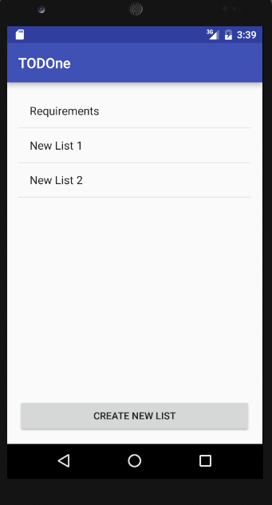

#TODOne:
###A to-do list app by Spencer "$pizzy Ri¢h" Richmond

TODOne helps you go from To-do to to-already-done. By forcing users to complete all items on their list before even **CLOSING THE APP**, **PRESSING THE BACK BUTTON** or even **ROTATING THE DEVICE**, deadline urgency is established.

Users hoping to dilly-dally or create a list and review it later are **OUT OF LUCK** and should **DOWNLOAD A DIFFERENT APP!**

###How to TODOne:
First, users **MUST** create a new list by **CLICKING THE BIG "CREATE NEW LIST" BUTTON AT THE BOOTOM**.

Then users should **NAME THEIR NEW LIST** and **CLICK THE "SET TITLE" BUTTON**.

Then users should **CLICK ON THEIR NEWLY CREATED LIST** to view it.

Finally, users should **CLICK THE "ADD NEW TODO ITEM" BUTTON AT THE BOTTOM** to add as many new items as they desire.

![List View] (TODOne List View.png)